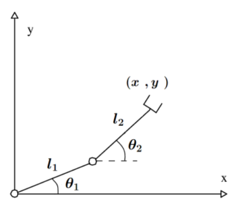
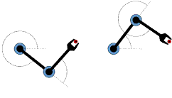
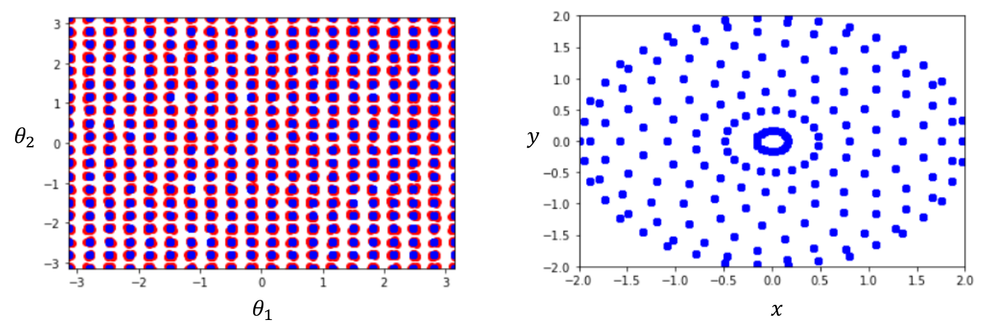
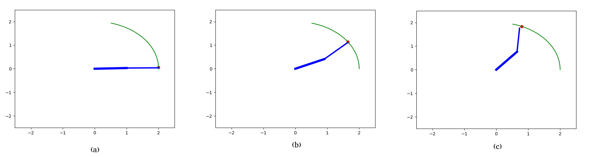
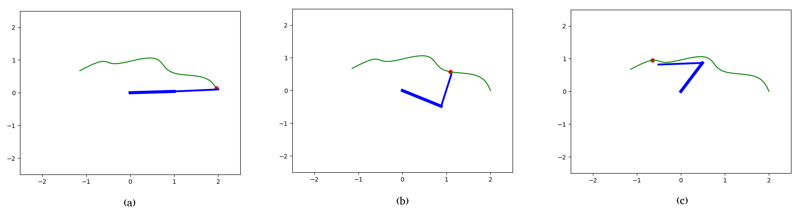

# Deep-Neural-Network-for-Solving-the-Inverse-Kinematics-Problem

## Introduction
In this project, it is intended to develop adeep neural network model for solving the inverse kinematics problem for the planar robotic manipulator with two revolute joints presented in Fig. 1. To train the neural network, a large dataset of joint angles and their corresponding end effector position and orientation will be needed. We will utilize the forward kinematic equations in (1) of the tackled robotic manipulator to generate this data set. Afterwards, we will train a deep network on the generated data and validate its performance on an unseen test data.

$$ x = l_1 cos(\theta_1) + l_2 cos(\theta_2) $$
$$ y = l_1 sin(\theta_1) + l_2 sin(\theta_2) $$

## Challenge
The challenge or difficulty in training a neural network to solve the inverse kinematics problem is the fact that the same end effector position (input of the neural network) can be achieved via several sets of joints variables (neural network output). In other words, the mapping between the neural network’s inputs and outputs is not one to one. This can be seen in Fig. 2 where the two-link robotic manipulator is capableof catching the same red ball, i.e., arriving at the same position, via two different joint configurations. To solve this issue, we should preprocess the data (or even change the format of the input and output data) to ensure that the function the neural network is trying to learn is one to one. One way to solve this redundacny problem is to pass the manipulator’s shape at the previous time instant as an input to the neural network. This additional input should guide the manipulator to the desired shape given that the manipulator’s motion is smooth (no sudden jumps).

## Data Generation
We start by assuming that the range of motion of the systems’ joints is limited to $[−\pi, \pi]$. Afterwards, we discretize the shape space into $n$ evenly spaced samples for each axis. Given that the considered system has two degrees of freedom, the discretization yields $n^2$ sample points spanning the entire shape space of the robot. In our example, we set $n$ to $20$. Then, for each of these sample points, which represent a specific set of joint variables, we utilize the forward kinematics equations to determine the corresponding position of the end-effector.

Up until now, we generated the end-effector positions $(x, y)$ we intend to input to the neural network and the joint variables which will be outputed by the neural network. However, as previously mentioned, we also need to include the manipulator’s shape from the previous time step as an input to the network. Assuming that the motion of the manipulator is smooth, the difference in the manipulator’s shape between any two consecutive time instances should be relatively small. Knowing this, for each manipulator shape/sample point in the discretized shape space, we generate $m$ random manipulator shapes that are slightly different from the considered sample point, where $m$ is set to $20$. These slightly varying manipulator shapes will serve as the manipulator shape in the previous time instance.

Accordingly, we now have a dataset of $mn^2$ data samples, where each sample is made up of an input vector that combines the position of the end-effector at time instant $i$ and the shape of the manipulator at the previous time instant $i−1$ as well as an output vector representing the desired shape of the manipulator at time instant $i$.

The dataset is displayed in Fig. 3. The blue points in Fig. 3a represent the generated sample points in the shape space of the manipulator. These sample points map to the end-effector position space as shown in Fig. 3b. We can see from Fig. 3 that the generated dataset spans the entire shape space and motion space of the robot. For each data sample (blue point) in Fig.3a, the $m$ slightly varying manipulator shapes are represented by the red points.

The generated dataset is saved into the “output.csv” file.

## Training and Testing the model

### Model Architecture

We will use a fully-connected network of the following architecture:

* An input layer having $4$ neurons.
* Two hidden layers each having $50$ neurons with Relu activation functions.
* An output layer having $2$ neurons with a linear activation.

### Training Setup

The cost functionto be minimized is the mean square error between the predicted manipulator’s shape and the shape mapping to the end-effector’s position at the consideredtime instant. We are using Adam as an optimizer with a constant learning rate set to $0.01$. The optimization runs for a maximum of $200$ iterations, however, the optimization is set to terminate if the cost function stops improving, in particular, if $20$ consecutive iterations passes without an improvemet in the cost.

### Training and Testing

The generated dataset is divided randomly into $90\%$ training data and $10\%$ testing data. The root mean squared error of the training dataset and testing dataset is $0.0454$rads and $0.0459$rads, respectively. The trained model is saved in “arm model.h5” file.

## Simulation

Given a desired trajectory $(x(t), y(t))$ for the end-effector to traverse, the trained model can be utilized to solve for the shape trajectory $(θ_1 (t), θ_2 (t))$ required to satisfy the end-effector’s motion. To simulate the motion of the arm, the arm is set to start from an initial shape of $(θ_1^0 , θ_2^0 ) = (0, 0)$. The motion of the arm is simulated for $t ∈ [0, 5π]$ for the two trajectories:

Trajectory 1: $(x(t), y(t)) =(2 − 0.2t + 0.1sin(t), −0.01t^2 + 0.2t + 0.1sin(t))$

Trajectory 2: $(x(t), y(t)) =(2cos(t/12), 2sin(t/12))$

The given trajectories are discretized over the specified time domain with a constant time step of $5π/100$ resulting in a set of waypoints for the manipulator to traverse. These end-effector position waypoints will serve as inputs for the neural network. That is, given the position waypoint $(x^1 , y^1)$ at $t_1$ and the initial manipulator shape $(θ_1^0 , θ_2^0)$ at $t_0$, we utilize the neural network to generate the manipulators shape at $t_1$ , $(θ_1^1 , θ_2^1)$. Afterwards, using the generated shape $(θ_1^1 , θ_2^1)$ and the position waypoint $(x^2 , y^2)$, we generate the manipulators shape at $t_2$ , $(θ_1^2 , θ_2^2)$. This process repeats for all subsequent time instants.

After predicting the manipulator’s shape for all time instants, the motion of the robot is simulated. This is implemented in the “test arm model.py” file. Snapshots of the manipulator’s motion for “Trajectory 1” and “Trajectory 2” are shown in Fig. 4 and Fig. 5, respectively.

